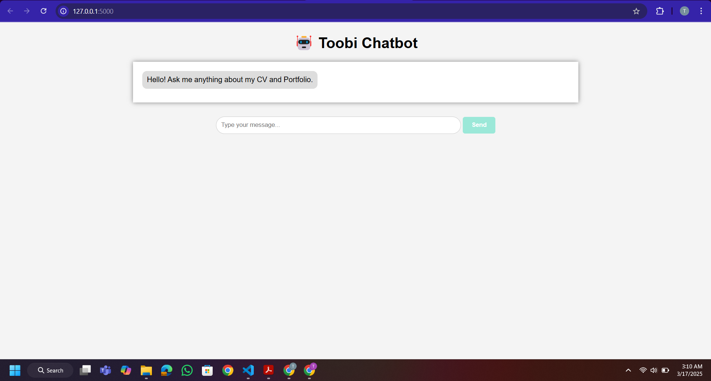
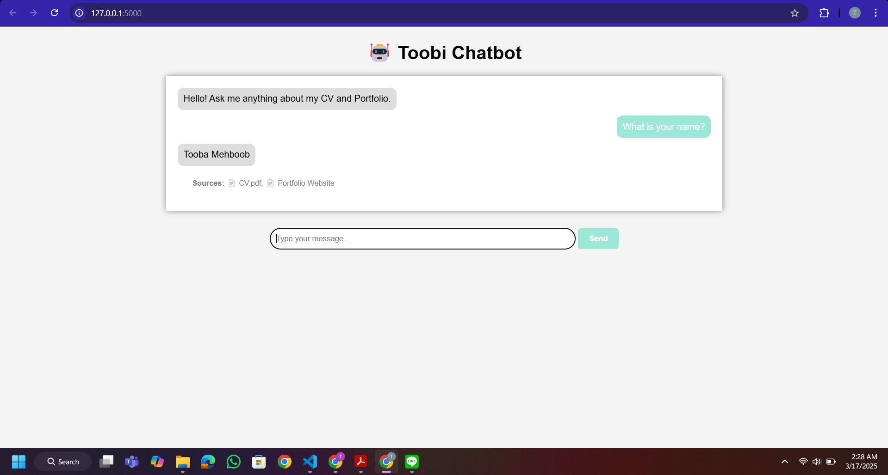
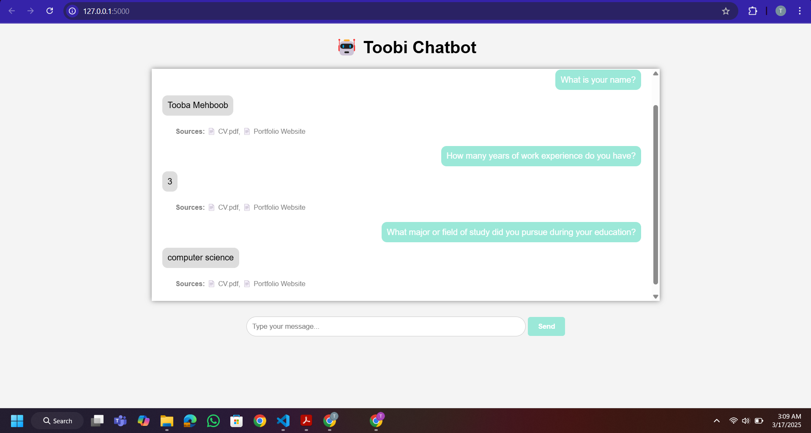

# A6_Talk_with_yourself

## TASK 1
1. Source I used: 
 - My CV (CV.pdf) 
 - Portfolio Website ([tooba-portfolio.vercel.app](https://tooba-portfolio.vercel.app/#portfolio)) 
 
These both serve as primary sources of information about my professional profile. They contain educational qualifications, skills, work experience, and personal projects, making them relevant references for answering questions about yourself.

2. Designed Prompt and developed model using:
-  **FAIASS** as **retriever**
- **sentence-transformers/all-MiniLM-L6-v2** as **embedding model**
- **google/flan-t5-large** as **generator**

3. 
- Explored the already given 01-rag-lanchain.ipynb.
- Also used **tiiuae/falcon-7b-instruct**
- Explored **google/flan-t5-large** (Best Capabilities)

## TASK 2
1.
### 📌 Utilized Retriever & Generator Models

| **Category**   | **Model Used**                                  | **Purpose**                                           |
|---------------|-----------------------------------------------|------------------------------------------------------|
| **Retriever** | **FAISS**                                      | Finds relevant text snippets from CV & Portfolio.   |
| **Retriever** | `"tiiuae/falcon-7b-instruct"`                 | Large-scale instruction-tuned model for retrieval.  |
| **Retriever** | `"hkunlp/instructor-base"`                     | Embedding model for retrieval improvement.          |
| **Embedding** | `"sentence-transformers/all-MiniLM-L6-v2"`     | Converts text into dense vector embeddings.         |
| **Embedding** | `"hkunlp/instructor-base"`                     | Instruct embedding model for better representation. |
| **Generator** | `"google/flan-t5-large"`                       | Generates structured responses from retrieved text. |
| **Generator** | `"lmsys/fastchat-t5-3b-v1.0"`                  | Instruction-tuned T5 model for conversational tasks.|

2.
Models like FLAN-T5 and FastChat-T5 sometimes generate unrelated or hallucinated responses due to weak retrieval grounding, where FAISS may fetch loosely related content if embeddings like "sentence-transformers/all-MiniLM-L6-v2" lack contextual understanding. Additionally, instruction-tuned generators tend to fabricate answers when no relevant data is retrieved. To fix this, better embeddings like "hkunlp/instructor-base" should be used for FAISS retrieval, and retrieval verification should be implemented—ensuring the model responds with "I don’t have this information" instead of fabricating details. Strengthening the prompt to force source-based responses and refining retrieval logic will significantly improve answer relevance and accuracy. 

## TASK 3

## Chatbot Development

